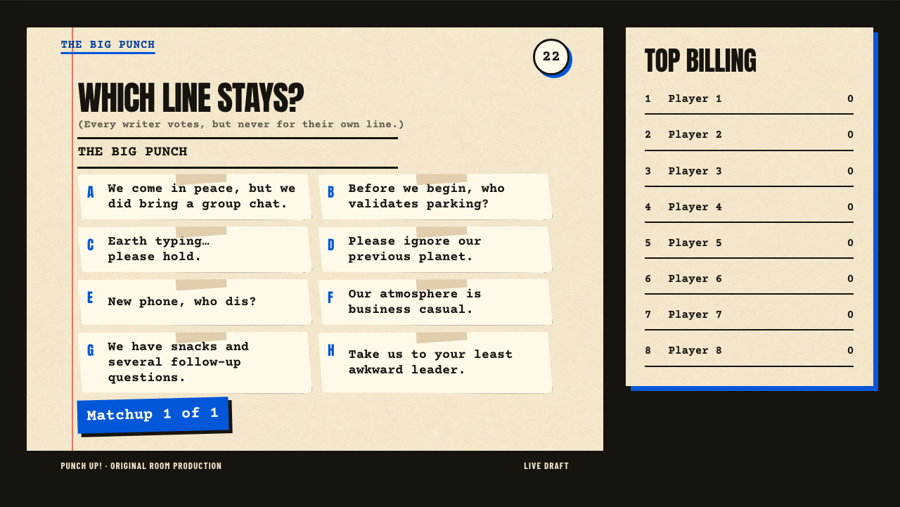
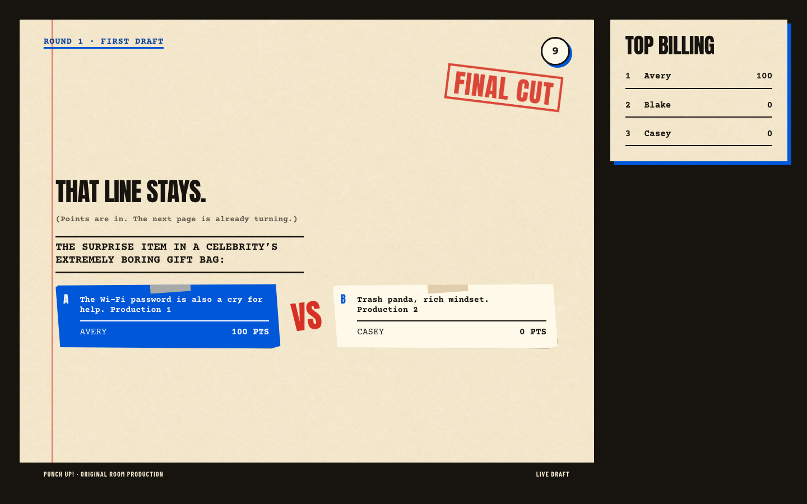

# Punch Up!

Punch Up! is a 3–8 player comedy party game for Toilet Paper Games. Every player writes punchlines on a phone, the room votes on anonymous head-to-head rewrites, and the winning lines take over a passive shared display.

The visual world is a comedy writer’s marked-up screenplay under deadline: warm cream script stock, dense production ink, electric-blue revision pencil, dry red stamps, matte tape, and hard offset shadows. It deliberately avoids the usual neon-comedy-club look.

## Game loop

1. Write two private punchlines in Round 1, “First draft.”
2. Vote on every matchup you did not write.
3. Repeat in Round 2, “Rewrite,” for double points.
4. Answer one shared finale prompt, “The big punch.” Every writer votes for another writer’s line.
5. Highest score gets top billing. Ties share the win.

The host and spectator surfaces are display-only. Controllers own every gameplay input. Sessions advance automatically when everyone finishes or a timer expires.

## Demo



The deterministic gallery also captures the [eight-player result reveal](./docs/screenshots/finale-results-eight.png) and [mobile writing controller](./docs/screenshots/controller-writing.png).



## Architecture

- `src/domain/`: pure transition engine and serializable state contract.
- `src/application/`: deterministic session planning and host-authoritative coordinator.
- `src/platform/`: the only `@tpgames/game-kit` adapter.
- `src/presentation/`: pure view models and HTML renderers for all surfaces.
- `src/testing/`: deterministic clocks, IDs, random source, runtime mock, fixtures, and scenario states.
- `surfaces/scenarios.html`: deterministic gallery for every meaningful phase.
- `tests/e2e/full-game.spec.ts`: five-controller browser journey with reconnect and authority transfer.

See [GAME_DESIGN.md](./GAME_DESIGN.md), [PRODUCT.md](./PRODUCT.md), and [docs/architecture.md](./docs/architecture.md) for the rules and system boundaries.

## Develop

```bash
npm install
npm run dev
```

Vite opens the multi-surface TPG workbench with five named controllers and a spectator. The workbench can move authority, disconnect/reconnect participants, and apply deterministic network conditions.

Open the deterministic state gallery:

```bash
npm run dev:scenarios
```

Run verification:

```bash
npm run typecheck
npm run test
npm run test:e2e
npm run validate
npm run smoke:production
```

`npm run validate` checks runtime boundaries and capabilities, builds the game, creates the registry archive, and runs strict TPG validation. The browser journey separately asserts that host markup contains no interactive or focusable controls while the live registry is on the manifest contract that predates `displayInteraction`.

## Bundle and publish

```bash
npm run bundle
npm run publish:dry-run
npm run publish:game
```

The publish command registers the production archive with the TPG registry using a browser-approved CLI session or a scoped `TPG_API_KEY`. Generated archives live in `dist/` and are not committed.

Published release: `punch-up-party` version `0.1.6`, discoverable as **Punch Up!** on [play.tp.games](https://play.tp.games).

## Design assets

The catalog art and subtle paper texture were generated for this game, optimized locally, and shipped inside the bundle. Their exact generation prompts and source paths are recorded in [docs/asset-provenance.md](./docs/asset-provenance.md). Anton, Barlow Condensed, and Courier Prime are bundled as local WOFF2 assets; their OFL license texts are checked into [docs/licenses](./docs/licenses/).
